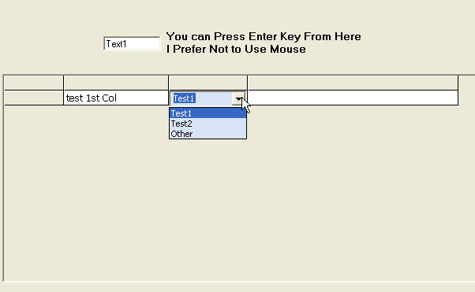



## FlexGrid Fully\-Editable

### Description

To Fully Manual Edit Content in MSHFlexGrid

You Will Not Need Any Other Special Control
 
### More Info
 
You Can Modify It Easily For Your Database Application

             |
---                |---
**Submitted On**   |2005-06-25 02:00:06
**By**             |[Pornprasit Jantara Dr\.](https://github.com/Planet-Source-Code/PSCIndex/blob/master/ByAuthor/pornprasit-jantara-dr.md)
**Level**          |Intermediate
**User Rating**    |5.0 (20 globes from 4 users)
**Compatibility**  |VB 6\.0
**Category**       |[Coding Standards](https://github.com/Planet-Source-Code/PSCIndex/blob/master/ByCategory/coding-standards__1-43.md)
**World**          |[Visual Basic](https://github.com/Planet-Source-Code/PSCIndex/blob/master/ByWorld/visual-basic.md)
**Archive File**   |[FlexGrid\_F1905506252005\.zip](https://github.com/Planet-Source-Code/pornprasit-jantara-dr-flexgrid-fully-editable__1-61321/archive/master.zip)

